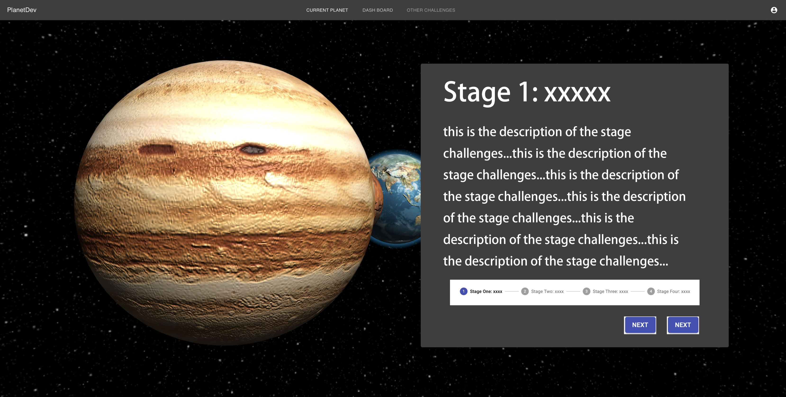

# TODO
- [ ] LoginPage 3js: further polish planet textures
- [ ] MainPage 3js: implement camera moving orbit
- [ ] MainPage 3js: Add card element (material-ui/card) to the 3d page to make it look like a stage selecting interface 
      the card should be responsible for:  
      - indicating current progress (by using material-ui/stepper) 
      - indicating current chapter (the title in the screenshot should be 'chapter' instead of 'stage 1') 
      - hold the description of the chapter 
      - hold 2 buttons: left = "switch to another planet", right = "continue the journey" == "continue this chapter" 

the interface should look like:

